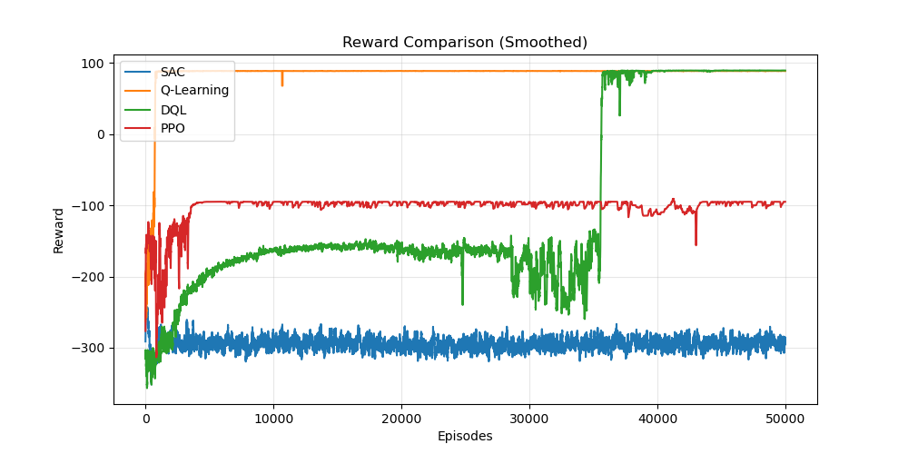
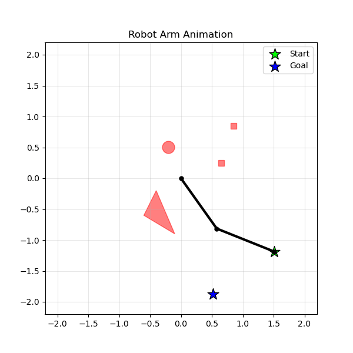
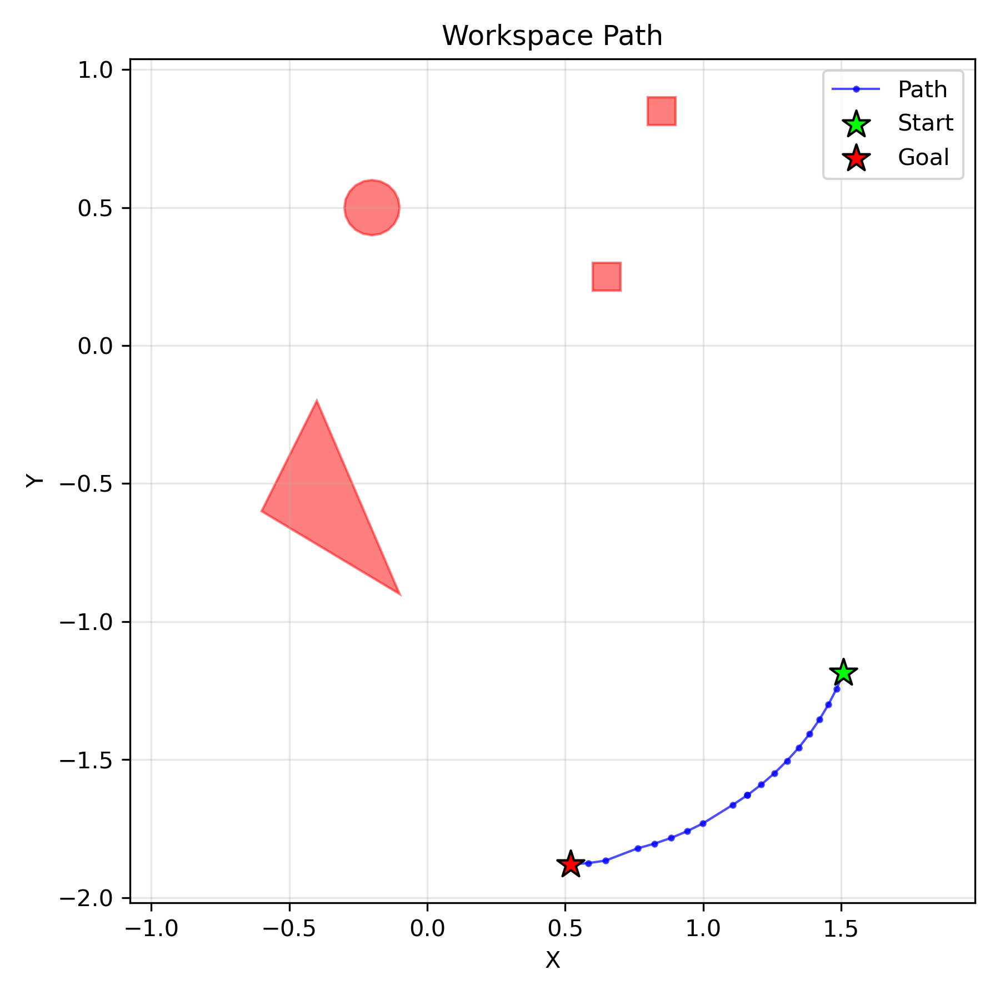
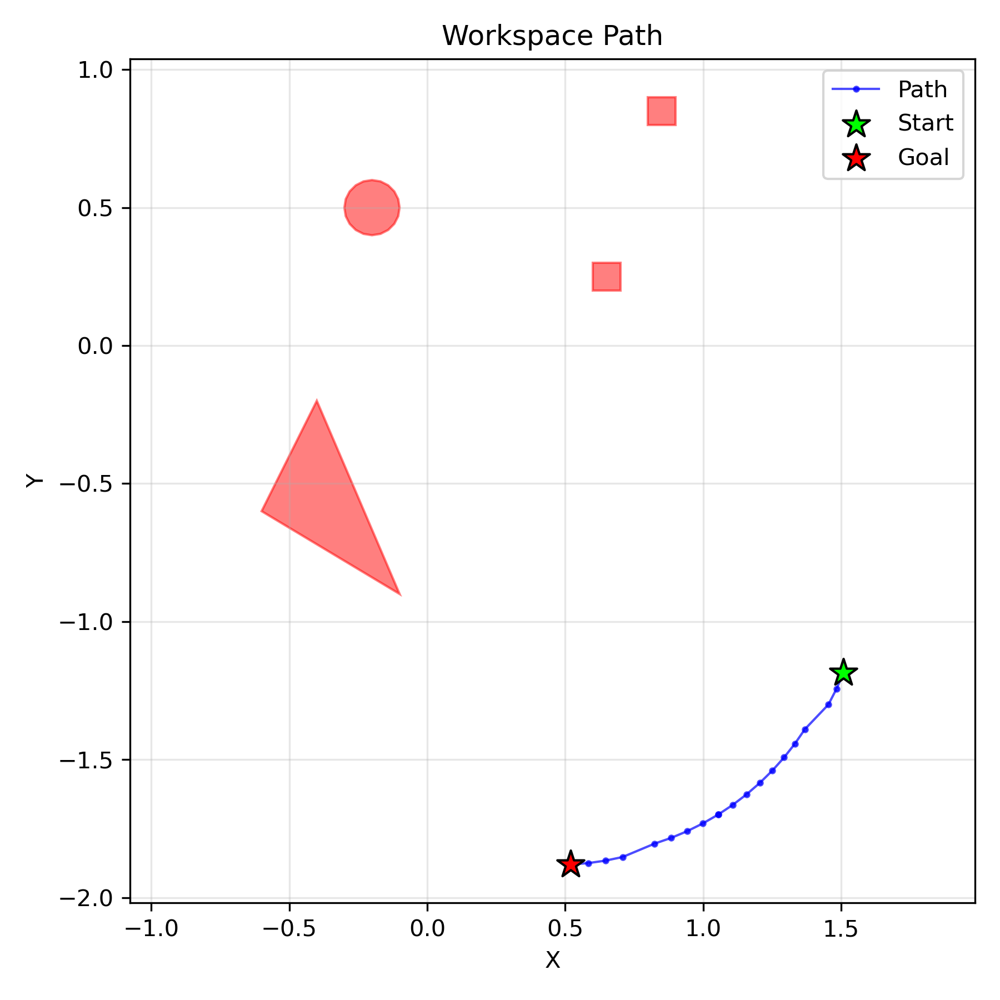
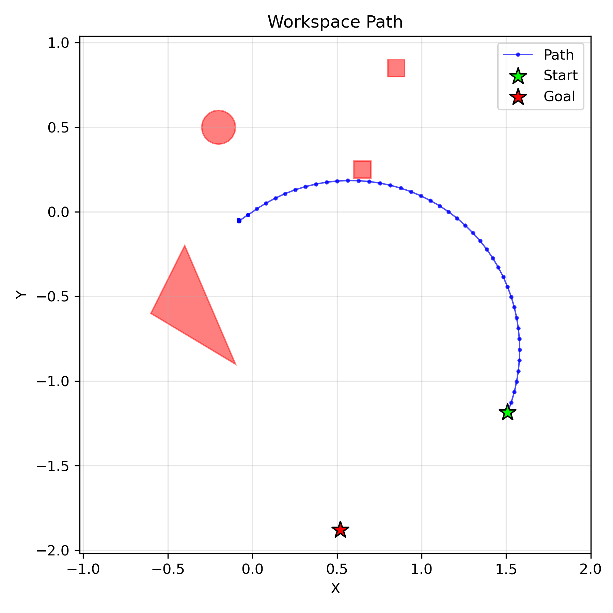

# AgenticRoboArm: Deep RL for C-Space Navigation

A Python implementation of motion planning for a 2-DOF planar robotic arm in configuration space. This project serves as a comparative benchmark to evaluate the performance of four different Reinforcement Learning algorithms (Q-Learning, DQL, PPO, and SAC) in finding collision-free paths in robotics, particularly handling sparse reward environments.

## Table of Contents
- [Overview](#overview)
- [Theoretical Background](#theoretical-background)
- [Project Structure](#project-structure)
- [Installation](#installation)
- [Usage](#usage)
- [Results & Analysis: Tabular vs Deep RL](#results--analysis-tabular-vs-deep-rl)
- [Configuration](#configuration)
- [Common Issues](#common-issues)
- [License](#license)
- [Author](#author)

## Overview

This project implements robot motion planning for a two-link planar robotic arm operating in a workspace with obstacles. The robot learns to navigate from a start configuration to a goal configuration using a discrete action space. It compares traditional tabular reinforcement learning against modern deep reinforcement learning approaches.

### Key Features
- **2-DOF Planar Arm**: Forward kinematics for a two-link manipulator.
- **Configuration Space (C-Space)**: Discretized representation (e.g., 100×100 grid) of valid arm configurations.
- **Collision Detection**: Uses the `shapely` library for robust geometric collision checking.
- **Multi-Agent RL Benchmark**: Implements and compares Q-Learning, Deep Q-Network (DQL), Proximal Policy Optimization (PPO), and Soft Actor-Critic (SAC).
- **Auto-Topology Analysis**: Uses `scipy` to analyze C-Space connectivity, automatically finding valid, mutually reachable Start and Goal points within the largest free-space island.
- **Visualization**: Multiple visualization tools including workspace path plotting, C-space connectivity maps, and animated `.gif` trajectories.

## Theoretical Background

### Configuration Space
The **configuration space** (C-space) is a mathematical representation where each point corresponds to a unique configuration of the robot. For a 2-DOF planar arm:
- **Configuration**: (θ₁, θ₂) where θ₁ and θ₂ are joint angles
- **C-Obs**: $$C_{\text{obs}} $$ = Set of configurations where the arm collides with obstacles 
- **C-Free**: $$C_{\text{free}} $$ = Set of configurations where the arm doesn't collide with obstacles
- **C-Space**: $C = C_{\text{free}} \cup C_{\text{obs}}$
- **Robot Motion Planning**: Finding a collision-free path in C-space that moves the robot from start to goal as fast as possible and then maps it to a valid motion in the workspace.

This implementation treats the configuration space as periodic (toroidal topology):
- Joint angles wrap around at the boundaries: θ ∈ [0, 2π)
- Moving beyond 2π wraps back to 0, and moving below 0 wraps to 2π
- This reflects the physical reality that 0° and 360° represent the same arm configuration
- Mathematical representation: States at indices 0 and N-1 are adjacent in the discretized grid

Advantages:
- More natural representation of rotational joints
- Enables shorter paths that cross the boundary
- Better connectivity in the free configuration space

### Forward Kinematics

The end-effector position (x, y) is computed from joint angles:

```
x = l₁·cos(θ₁) + l₂·cos(θ₁ + θ₂)
y = l₁·sin(θ₁) + l₂·sin(θ₁ + θ₂)
```

where l₁ and l₂ are the link lengths.


### Reinforcement Learning Approaches
The environment features **sparse rewards**, making exploration challenging. The project explores multiple algorithms to estimate the optimal policy $\pi^*$ or action-values $Q(s, a)$.

**Action Space (Discrete)**:
- Action 0: Increase θ₁ $\rightarrow$  `i_new = (i + 1) % N₁`
- Action 1: Decrease θ₁ $\rightarrow$  `i_new = (i - 1) % N₁`
- Action 2: Increase θ₂ $\rightarrow$  `j_new = (j + 1) % N₂`
- Action 3: Decrease θ₂ $\rightarrow$  `j_new = (j - 1) % N₂`
  
The modulo operator `%` implements the periodic wrapping, allowing the agent to explore paths that cross the 0/2π boundary.

**Reward Structure**:
- Goal reached: +100
- Collision: -10 (or -100 depending on config, stays in same state and terminates)
- Each step: Small negative penalty proportional to the Manhattan distance to the goal to encourage shortest paths without stalling.

**Algorithms**:
1. **Q-Learning**: A tabular baseline.
2. **Deep Q-Learning (DQL)**: Uses a neural network to approximate Q-values, combined with a Replay Buffer.
3. **PPO (Proximal Policy Optimization)**: An on-policy actor-critic algorithm balancing sample complexity and stability.
4. **Discrete SAC (Soft Actor-Critic)**: Adapted from continuous domains, this off-policy algorithm uses an entropy-regularized framework to encourage exploration. The actor network outputs a categorical distribution (probabilities via Softmax), enabling the calculation of exact expected Q-values without the reparameterization trick.

## Project Structure

```
AgenticRoboArm/
├── src/                      # Core environment and robot logic
│   ├── arm.py                # 2-DOF planar arm kinematics
│   ├── cspace.py             # Configuration space generation
│   ├── obstacle.py           # Collision detection logic (Shapely)
│   ├── arm_env.py            # Gymnasium-compatible RL environment
│   └── visualize.py          # Plotting and GIF animation utilities
├── src/agents/               # PyTorch RL Agent implementations
│   ├── qlearning.py          # Tabular Q-Learning
│   ├── dql.py                # Deep Q-Network
│   ├── ppo.py                # Proximal Policy Optimization
│   └── sac.py                # Discrete Soft Actor-Critic
├── scripts/                  # Executable training scripts
│   ├── main_comparison.py    # Sequential multi-agent training & benchmark
│   └── main_single_agent.py  # Script for testing/tuning a single algorithm
├── results/                  # Auto-generated output directory
└── requirements.txt          # Python dependencies

```
### Module Descriptions

- `src/arm.py`: Implements the PlanarArm2DOF class with forward kinematics and segment computation for collision detection.

- `src/obstacle.py`: Provides functions to create geometric obstacles (rectangles, circles, polygons) using Shapely and collision detection between arm segments and obstacles.

- `src/cspace.py`: Builds a discretized configuration space by checking collisions for all possible joint angle combinations.

- `src/arm_env.py`: Wraps the robot and the C-Space in a standard Gymnasium-like API (step, reset, render) with defined observation and action spaces.

- `src/agents/*.py`: Contains the implementations of the four RL algorithms, featuring advanced mechanisms like Replay Buffers, target networks, and advantage estimation.

- `scripts/main_comparison.py`: Orchestrates the entire pipeline: constructs the environment, performs topological analysis to find valid starts/goals, trains all agents sequentially, and generates the final JSON summaries and plots.

## Installation

1. Clone the repository:

```bash
git clone [https://github.com/your-username/AgenticRoboArm.git](https://github.com/your-username/AgenticRoboArm.git)
cd AgenticRoboArm

```

2. Install the required dependencies:

```bash
pip install -r requirements.txt

```

*Main dependencies include `gymnasium`, `torch`, `numpy`, `matplotlib`, `shapely`, `scipy`, and `Pillow`.*

## Usage

To run the complete benchmark comparing all four agents:

```bash
python scripts/main_comparison.py

```
This will:
1. Create a 2-DOF arm with unit link lengths
2. Define sample obstacles in the workspace
3. Build the configuration space (100×100 discretization)
4. Find a mathematically valid, reachable Start and Goal state
5. Train the 4 agents based on their assigned episodes
6. Generate JSON summaries, comparison plots, and animated GIFs in the results/ folder.

**Customizing the Setup**
Edit `scripts/main_comparison.py` to customize:
**Agent Episode Allocation**:
To balance the training times between tabular and deep methods, episode counts are mapped in a dictionary:
```python
EPISODES = {
        'Q-Learning': 50000,  # Needs more episodes to converge in a large state space
        'SAC': 30000,         # Deep RL convergence
        'DQL': 30000,         
        'PPO': 30000          
    }
```

To test and tune a specific agent individually:
```bash
python scripts/main_single_agent.py

```

## Results & Analysis: Tabular vs. Deep RL

The benchmark revealed a fascinating and highly educational limitation of Deep Reinforcement Learning when applied to discrete, sparse-reward navigation tasks.

After extensive training (up to 50,000 episodes per agent), Tabular Q-Learning completely dominated the environment (achieving >93% success rate), while the Deep RL agents (SAC, DQL, PPO) severely struggled to find the goal, often converging to a 0% success rate even with heavily tuned hyperparameters.

**Why did Deep RL fail while Tabular Q-Learning succeeded?**

1. **Replay Buffer Dilution (The "Needle in a Haystack" Problem)**: In a 100x100 grid, finding the goal by random exploration takes thousands of episodes. When a Deep RL agent finally discovers the rare +100 reward, that single positive experience is saved in a massive Replay Buffer (e.g., 100,000 transitions) alongside millions of negative step penalties. During batch sampling, the network rarely sees the winning transition, causing the positive signal to be "drowned out." Q-Learning, conversely, updates its exact state-action table immediately and permanently without forgetting.
2. **Periodic Boundary Topology**: The configuration space is toroidal (angles wrap from 2π back to 0). For tabular Q-Learning, state 99 and state 0 are just two abstract keys in a dictionary; it easily understands they are adjacent. For a Neural Network, transitioning from normalized input 0.99 to 0.00 is seen as a massive, discontinuous numerical jump. Without specialized trigonometric encodings (like feeding sin(θ), cos(θ) instead of scalar indices), the network struggles to map the continuous loop of the borders.
3. **The "Suicide" Policy (Reward Hacking)**: Since the environment issues a small negative reward for every step taken (to encourage the shortest paths), the Neural Networks quickly learn that exploring the vast empty space yields endless penalties. To minimize expected loss, the policy converges on a local optimum: purposely crashing into the nearest obstacle to terminate the episode as fast as possible.

### Training Oputput
The comparison script provides detailed execution feedback and generates a JSON summary for each agent upon completion:
```json 
--- SUMMARY: Q-Learning ---
{
    "agent_name": "Q-Learning",
    "episodes": 50000,
    "final_success_rate": 93.578,
    "average_reward": 69.548,
    "path_length": 49,
    "training_time_seconds": 47642.93,
    "goal_reached": true,
    "has_loops_in_final_path": false
}
```

### Visual Outputs
- **`cspace_connectivity.png`**: Shows connected components of free space, where each component is colored differently to ensure the Start and Goal are topologically reachable.
  
- **`comparison_reward.png`**: Graph overlaying the smoothed episodic rewards of all algorithms, highlighting convergence speeds.
  
- **`anim_[AGENT].gif`**: Animated visualization of the complete robot arm executing the learned path. with:
   + The two-link arm shown in black
   + Obstacles shown in red with transparency
   + A trailing path showing the end-effector trajectory
   + Start position marked with a green star
   + Goal position marked with a blue star
        * DQL: 
        * Tabular Q-Leraning: 
        * PPO: 
        * SAC: 
- **`path_[AGENT].png`**: Displays the learned trajectory in workspace coordinates, showing the end-effector path from start to goal.
    * DQL: 
    * PPO: 
    * Tabular Q-Learning: 
    * SAC: 

## Configuration

### Training lenghts
The training lengths can be managed directly in the main_comparison.py via the EPISODES dictionary. For example:
- **Q-Learning**: 50000 episodes (needs full table exploration).
- **SAC / DQL / PPO**: 15000 to 30000 episodes depending on computational resources.

### Hyperparemeters

**Discount Factor (γ)**:
- Values close to 1 (0.95-0.99): Prioritizes long-term rewards, critical for Deep RL dealing with sparse rewards.
- Default: 0.99 for all agents.

**Exploration Rate (ε)**:
- Used by Q-Learning and DQL.
- Initial high value (0.9): Encourages exploration.
- Decays to minimum (0.01): Shifts to exploitation.

**Grid Resolution**:
- Configured via `N_DISCRETIZATION = 100`.
- Higher resolution (100×100): More precise but significantly slower training due to the exponential growth of the State Space (10,000 states).


**Max Steps per Episode**: Hard limit (e.g., `500` steps) to truncate episodes and prevent infinite loops during early, blind exploration.

## Common Issues

**Start/Goal in Obstacle**:

```
ValueError: Start state is in collision!

```

*Solution*: The `main_comparison.py` script uses `scipy.ndimage.label` to automatically prevent this. If setting coordinates manually in `main_single_agent.py`, ensure they fall within the free C-space.

**Agent Stuck in Infinite Loop / No Terminal Output**:
*Solution*: Ensure the training loop contains a `max_steps` counter (e.g., `for step in range(500):`) so the episode forcibly truncates if the agent neither collides nor finds the goal.

**Exploding Gradients / NaN Loss (Deep RL)**:

```
RuntimeError: found invalid values: tensor([[nan, nan, nan, nan]])

```

*Solution*: This occurs when network outputs approach zero, causing `log(0)` in entropy calculations. Ensure probabilities are clamped (e.g., `torch.clamp(probs, min=1e-8)`) and apply gradient clipping (`torch.nn.utils.clip_grad_norm_`).

**Understanding Periodic Boundary Effects**:

* Paths may appear discontinuous in C-space visualizations when crossing the 0 or 2π boundary.
* In the physical workspace, these paths represent continuous, valid robot motions (a full 360-degree rotation of a joint).

## License

This project is licensed under the MIT License - see the LICENSE file for details.

## References
1. Battistelli G., Autonomous Agents and Intelligent Robotics course (2024)
2. Bagdanov A. D., Deep Learning Applications course (2025)

## Author

eledaveri

## Acknowledgments

This project was developed as an educational implementation of path planning using deep reinforcement learning for robotic manipulators, extending foundational tabular approaches to modern continuous/discrete actor-critic frameworks.

