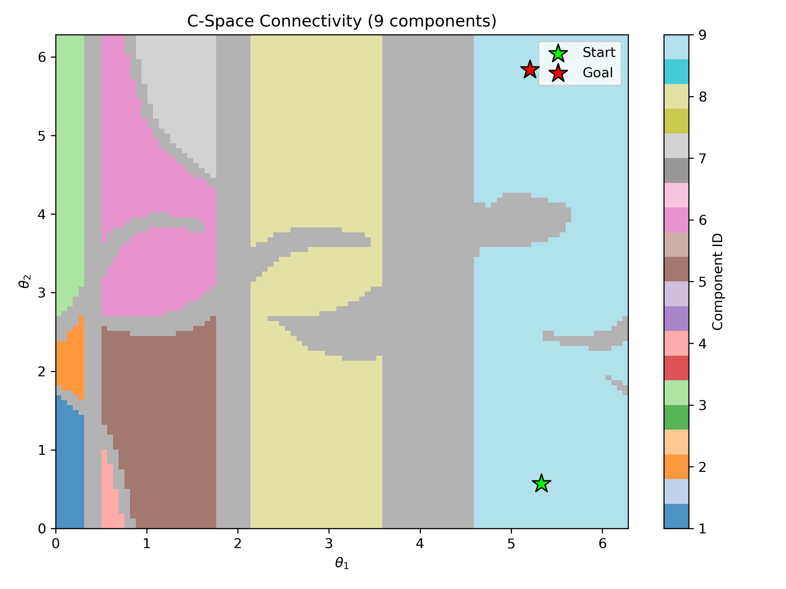
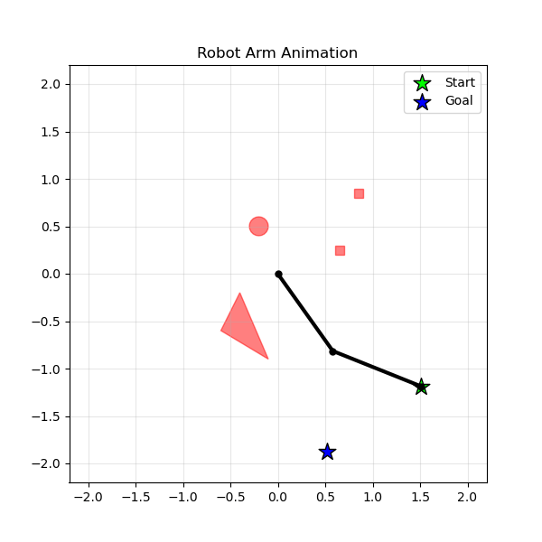

# AgenticRoboArm: Deep RL for C-Space Navigation

A Python implementation of motion planning for a 2-DOF planar robotic arm in configuration space. This project serves as a comparative benchmark to evaluate the performance of four different Reinforcement Learning algorithms (Q-Learning, DQL, PPO, and SAC) in finding collision-free paths in robotics, particularly handling sparse reward environments.

## Table of Contents
- [Overview](#overview)
- [Theoretical Background](#theoretical-background)
- [Project Structure](#project-structure)
- [Installation](#installation)
- [Usage](#usage)
- [Results & Analysis: Tabular vs Deep RL](#results--analysis-tabular-vs-deep-rl)
- [Configuration](#configuration)
- [Common Issues](#common-issues)
- [License](#license)
- [Author](#author)

## Overview

This project implements robot motion planning for a two-link planar robotic arm operating in a workspace with obstacles. The robot learns to navigate from a start configuration to a goal configuration using a discrete action space. It compares traditional tabular reinforcement learning against modern deep reinforcement learning approaches.

### Key Features
- **2-DOF Planar Arm**: Forward kinematics for a two-link manipulator.
- **Configuration Space (C-Space)**: Discretized representation (e.g., 100×100 grid) of valid arm configurations.
- **Collision Detection**: Uses the `shapely` library for robust geometric collision checking.
- **Multi-Agent RL Benchmark**: Implements and compares Q-Learning, Deep Q-Network (DQL), Proximal Policy Optimization (PPO), and Soft Actor-Critic (SAC).
- **Auto-Topology Analysis**: Uses `scipy` to analyze C-Space connectivity, automatically finding valid, mutually reachable Start and Goal points within the largest free-space island.
- **Visualization**: Multiple visualization tools including workspace path plotting, C-space connectivity maps, and animated `.gif` trajectories.

## Theoretical Background

### Configuration Space
The **configuration space** (C-space) is a mathematical representation where each point corresponds to a unique configuration of the robot. For a 2-DOF planar arm:
- **Configuration**: (θ1, θ2) representing the angles of the two joints.
- **Free Space**: Configurations where the robot does not intersect any obstacles.
- **Obstacle Region**: Configurations where the robot collides with workspace obstacles.
Planning in C-space reduces the complex robot body to a single point navigating through a 2D grid.

### Reinforcement Learning Approaches
The environment features **sparse rewards** (a heavy penalty for collision, and a large +100 reward only upon reaching the exact goal). To solve this, the project explores:
1. **Q-Learning**: A tabular baseline.
2. **Deep Q-Learning (DQL)**: Uses a neural network to approximate Q-values, combined with a Replay Buffer.
3. **PPO (Proximal Policy Optimization)**: An on-policy actor-critic algorithm balancing sample complexity and stability.
4. **Discrete SAC (Soft Actor-Critic)**: Adapted from continuous domains, this off-policy algorithm uses an entropy-regularized framework to encourage exploration. The actor network outputs a categorical distribution (probabilities via Softmax), enabling the calculation of exact expected Q-values without the reparameterization trick.

## Project Structure

```
AgenticRoboArm/
├── src/                      # Core environment and robot logic
│   ├── arm.py                # 2-DOF planar arm kinematics
│   ├── cspace.py             # Configuration space generation
│   ├── obstacle.py           # Collision detection logic (Shapely)
│   ├── arm_env.py            # Gymnasium-compatible RL environment
│   └── visualize.py          # Plotting and GIF animation utilities
├── src/agents/               # PyTorch RL Agent implementations
│   ├── qlearning.py          # Tabular Q-Learning
│   ├── dql.py                # Deep Q-Network
│   ├── ppo.py                # Proximal Policy Optimization
│   └── sac.py                # Discrete Soft Actor-Critic
├── scripts/                  # Executable training scripts
│   ├── main_comparison.py    # Sequential multi-agent training & benchmark
│   └── main_single_agent.py  # Script for testing/tuning a single algorithm
├── results/                  # Auto-generated output directory
└── requirements.txt          # Python dependencies

```

## Installation

1. Clone the repository:

```bash
git clone [https://github.com/your-username/AgenticRoboArm.git](https://github.com/your-username/AgenticRoboArm.git)
cd AgenticRoboArm

```

2. Install the required dependencies:

```bash
pip install -r requirements.txt

```

*Main dependencies include `gymnasium`, `torch`, `numpy`, `matplotlib`, `shapely`, `scipy`, and `Pillow`.*

## Usage

To run the complete benchmark comparing all four agents:

```bash
python scripts/main_comparison.py

```

*Note: The script will automatically build the C-Space grid, find the largest connected component, select a reachable Start/Goal pair, and train the agents sequentially.*

To test and tune a specific agent individually:

```bash
python scripts/main_single_agent.py

```

## Results & Analysis: Tabular vs. Deep RL

The benchmark revealed a fascinating and highly educational limitation of Deep Reinforcement Learning when applied to discrete, sparse-reward navigation tasks.

After extensive training (up to 50,000 episodes per agent), Tabular Q-Learning completely dominated the environment (achieving >93% success rate), while the Deep RL agents (SAC, DQL, PPO) severely struggled to find the goal, often converging to a 0% success rate even with heavily tuned hyperparameters.

**Why did Deep RL fail while Tabular Q-Learning succeeded?**

1. **Replay Buffer Dilution (The "Needle in a Haystack" Problem)**: In a 100x100 grid, finding the goal by random exploration takes thousands of episodes. When a Deep RL agent finally discovers the rare +100 reward, that single positive experience is saved in a massive Replay Buffer (e.g., 100,000 transitions) alongside millions of negative step penalties. During batch sampling, the network rarely sees the winning transition, causing the positive signal to be "drowned out." Q-Learning, conversely, updates its exact state-action table immediately and permanently without forgetting.
2. **Periodic Boundary Topology**: The configuration space is toroidal (angles wrap from 2π back to 0). For tabular Q-Learning, state 99 and state 0 are just two abstract keys in a dictionary; it easily understands they are adjacent. For a Neural Network, transitioning from normalized input 0.99 to 0.00 is seen as a massive, discontinuous numerical jump. Without specialized trigonometric encodings (like feeding sin(θ), cos(θ) instead of scalar indices), the network struggles to map the continuous loop of the borders.
3. **The "Suicide" Policy (Reward Hacking)**: Since the environment issues a small negative reward for every step taken (to encourage the shortest paths), the Neural Networks quickly learn that exploring the vast empty space yields endless penalties. To minimize expected loss, the policy converges on a local optimum: purposely crashing into the nearest obstacle to terminate the episode as fast as possible.

### Visual Outputs
- **C-Space Connectivity**: Maps the safe topological islands.
  
- **Reward Comparison**: Notice the fast convergence of Q-Learning against the flatlined Deep RL networks.
  
- **Agent Evaluation Paths**: Animated visualization of the complete robot arm     executing the learned path, with:
   - The two-link arm shown in black
   - Obstacles shown in red with transparency
   - A trailing path showing the end-effector trajectory
   - Start position marked with a green star
   - Goal position marked with a blue star
DQL: 
Tabular Q-Leraning: 
PPO: 
SAC: 

   
## Configuration
The training lengths can be managed directly in the main_comparison.py via the EPISODES dictionary. For example:
- **Q-Learning**: 50000 episodes (needs full table exploration).
- **SAC / DQL / PPO**: 15000 to 30000 episodes depending on computational resources.

To effectively handle the sparse reward structure of the 100×100 grid, the Deep RL agents (DQL, SAC) require specific hyperparameters:

* **Discount Factor (γ)**: High value (`0.99` or `0.995`) to prevent severe reward discounting over long paths (>60 steps).
* **Replay Buffer**: Large capacity (`memory_size=100000`) to prevent catastrophic forgetting once the sparse goal is finally found.
* **Max Steps per Episode**: Hard limit (e.g., `500` steps) to truncate episodes and prevent infinite loops during early, blind exploration.

## Common Issues

**Start/Goal in Obstacle**:

```
ValueError: Start state is in collision!

```

*Solution*: The `main_comparison.py` script uses `scipy.ndimage.label` to automatically prevent this. If setting coordinates manually in `main_single_agent.py`, ensure they fall within the free C-space.

**Agent Stuck in Infinite Loop / No Terminal Output**:
*Solution*: Ensure the training loop contains a `max_steps` counter (e.g., `for step in range(500):`) so the episode forcibly truncates if the agent neither collides nor finds the goal.

**Exploding Gradients / NaN Loss (Deep RL)**:

```
RuntimeError: found invalid values: tensor([[nan, nan, nan, nan]])

```

*Solution*: This occurs when network outputs approach zero, causing `log(0)` in entropy calculations. Ensure probabilities are clamped (e.g., `torch.clamp(probs, min=1e-8)`) and apply gradient clipping (`torch.nn.utils.clip_grad_norm_`).

**Understanding Periodic Boundary Effects**:

* Paths may appear discontinuous in C-space visualizations when crossing the 0 or 2π boundary.
* In the physical workspace, these paths represent continuous, valid robot motions (a full 360-degree rotation of a joint).

## License

This project is licensed under the MIT License - see the LICENSE file for details.

## Author

eledaveri

## Acknowledgments

This project was developed as an educational implementation of path planning using deep reinforcement learning for robotic manipulators, extending foundational tabular approaches to modern continuous/discrete actor-critic frameworks.

